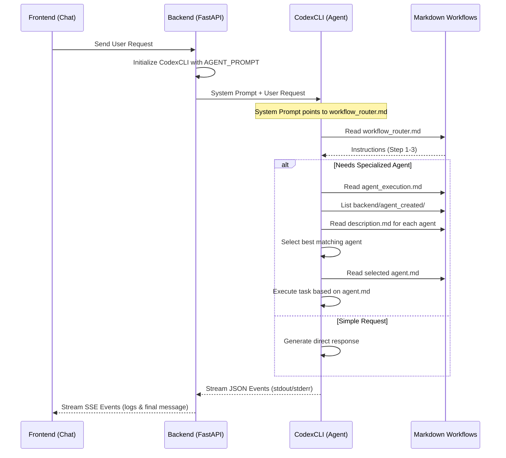

# Agentic Workflow System Architecture

This document details the current architecture of the Agentic Workflow System, focusing on the interaction between Markdown-defined workflows and the [CodexCLI](file:///Users/faizanpersonal/Desktop/Personal/Experimenting/agent/backend/services/codex_cli.py#126-287).

## Core Philosophy
The system operates on the principle of **Self-Directed Agentic Workflows**. Instead of hardcoding logic, "Workflows" are written in Markdown. These Markdown files serve as standard operating procedures (SOPs) that an LLM-based agent (invoked via [CodexCLI](file:///Users/faizanpersonal/Desktop/Personal/Experimenting/agent/backend/services/codex_cli.py#126-287)) reads, interprets, and executes in real-time.

---

## 🏗️ System Components

### 1. CodexCLI ([backend/services/codex_cli.py](file:///Users/faizanpersonal/Desktop/Personal/Experimenting/agent/backend/services/codex_cli.py))
The engine of the system. It is a wrapper around the [codex](file:///Users/faizanpersonal/Desktop/Personal/Experimenting/agent/backend/services/streaming.py#30-36) binary, which is an agentic execution environment.
- **Role**: Executes prompts with access to the file system and tools.
- **Capability**: Can run in "full-auto" mode, allowing the agent to perform multiple steps (read, write, list files) to achieve a goal.

### 2. Workflow Definitions (`backend/workflow_templates/workflow/`)
These are the "Brains" of the system, defined as Markdown files.
- `workflow_router.md`: The entry point. It instructs the agent on how to categorize a user request (Direct Response vs. Agent Required).
- `agent_execution.md`: The SOP for finding and running a specialized agent.

### 3. Agent Created (`backend/workflow_templates/agent_created/`)
Modular, specialized agents defined by a specific folder structure:
- `agent.md`: The core instructions for the agent's task.
- `description.md`: High-level purpose (used by the Router/Execution workflow to select the agent).
- `inputs/input_details.md`: Specifications for input data.
- `outputs/output_details.md`: Specifications for the expected result format.

---

## 🔄 The Execution Lifecycle



---

## 📂 Key File Structure

```text
backend/
├── config.py                 # Centralized prompts and paths
├── services/
│   ├── codex_cli.py          # Wrapper for 'codex exec'
│   └── streaming.py          # SSE generator and event parser
└── workflow_templates/
    ├── workflow/             # Global workflows
    │   ├── workflow_router.md
    │   └── agent_execution.md
    └── agent_created/        # Custom user-created agents
        └── {agent_name}/
            ├── agent.md
            ├── description.md
            ├── inputs/
            └── outputs/
```

## 🛠️ Execution Contexts
The system uses two primary prompt strategies defined in `config.py`:
1. **Router Prompt (`AGENT_PROMPT`)**: Tells the agent it is a router and points it to `workflow_router.md`. Used for general chat.
2. **Standalone Prompt (`RUN_STANDALONE_AGENT_PROMPT`)**: Used when a specific agent is pre-selected. It bypasses the router and gives direct instructions to follow `agent.md`.
